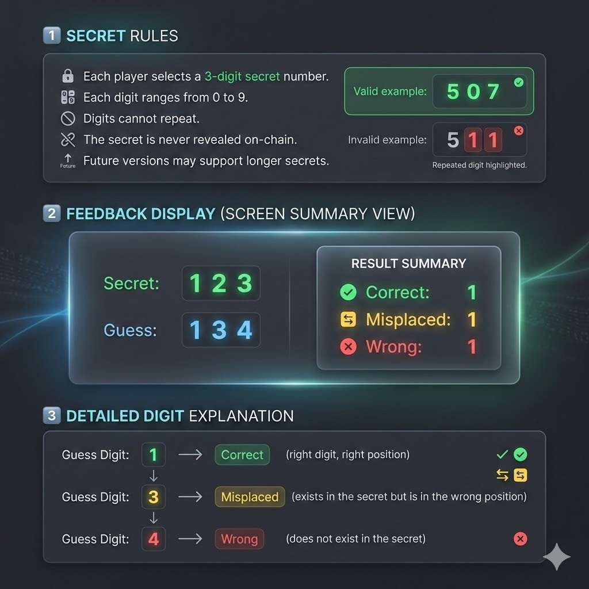
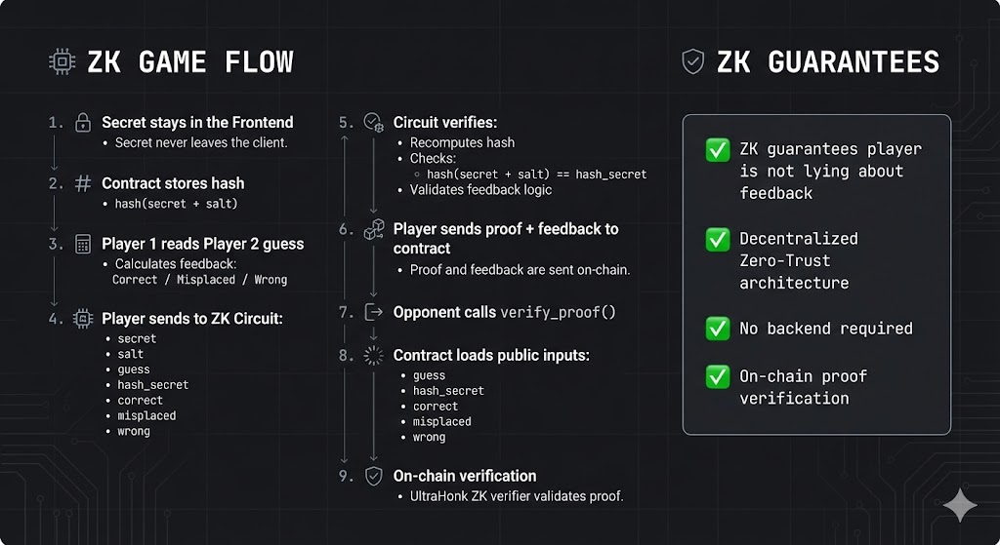
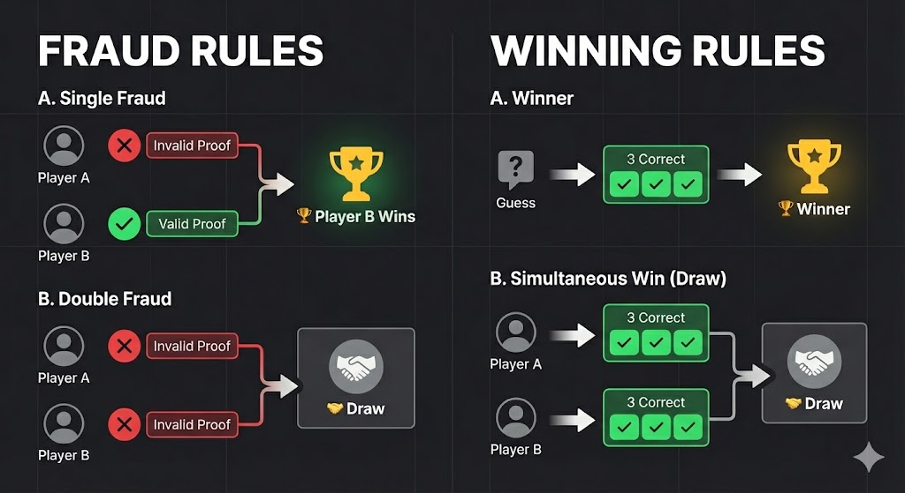

# ZK Gaming Stella: ZK PASS

## High-Level Description
**ZK PASS** is a zero-knowledge multiplayer game inspired by Wordle (or Mastermind), but using numbers instead of words. Each player chooses a secret 3-digit number, and the objective is to guess the opponent’s secret before they guess yours.

The core innovation lies in its **Zero-Knowledge** implementation: players use ZK proofs to provide feedback on guesses without ever revealing their secret number. This ensures cryptographic fairness and prevents players from lying about the results of a guess.

---

## Game Rules

### Secret Rules
- Each player chooses a secret **3-digit number** at the start of the game.
- Each digit must be between 0 and 9.
- Digits cannot be repeated.
- The secret length may be expanded in future versions for increased difficulty.
- The secret is never revealed to the smart contract.

### Guessing
- Players take turns submitting 3-digit guesses to the smart contract.
- After a guess is submitted, the defending player must provide feedback.

### Feedback Categories
Feedback is categorized into three types:
- **Correct**: The digit is correct and in the correct position.
- **Misplaced**: The digit exists in the secret but is in the wrong position.
- **Wrong**: The digit does not exist in the secret.

### Example

Secret: 123
Guess: 134

feedback:
 - 1 correct
 - 1 misplaced
 - 1 wrong


correct = 1 <br>
misplaced = 3 <br>
wrong = 4 <br>

---



## Zero-Knowledge Architecture
ZK PASS is built on a **Zero-Trust** foundation:
- **Privacy**: The secret number **NEVER** leaves the player’s local frontend/environment.
- **Integrity**: ZK proofs guarantee that the feedback provided (Correct/Misplaced/Wrong) is 100% honest according to the committed secret.
- **Commitment**: Once a secret is committed on-chain as a hash, it cannot be changed, ensuring the game's integrity from start to finish.

---

## ZK Flow (Step-by-Step)

### 1. Secret Commitment
Each player chooses a 3-digit secret and a random salt. They register a **Pedersen Hash** of the `(secret, salt)` on-chain. This proves the secret is fixed without revealing it.

### 2. Guess Submission
Players submit their guesses to the smart contract. These guesses are public and stored in the game state.

### 3. Feedback Generation + Proof Creation
The defending player performs the following locally:
1. Retrieves the opponent's guess from the contract.
2. Compares the guess with their private secret.
3. Computes the counts for **Correct**, **Misplaced**, and **Wrong**.
4. Passes these values into the **Noir Circuit** ([main.nr](../contracts/pass/src/main.nr)) along with the private `secret` and `salt`.

The circuit executes the following logic:
- Verifies that `Hash(secret, salt) == committed_hash`.
- Validates that the provided counts (Correct, Misplaced, Wrong) are mathematically correct.
- Generates an **UltraHonk** ZK proof using the [proofCalculator.ts](src/games/pass/utils/proofCalculator.ts).

The resulting ZK proof is then submitted to the smart contract.

### 4. On-Chain Verification
The smart contract ([lib.rs](../contracts/pass/src/lib.rs)) uses the `verify_zk_proof_internal` function to:
1. Reconstruct the public inputs (guess, committed hash, and feedback results).  
2. Use the `UltraHonkVerifier` to verify the cryptographic proof.
3. If verified, the game state is updated; otherwise, the submission is rejected or marked as fraud.




---

## Game Resolution & Outcomes

### Fraud Scenarios
- **Single Fraud**: If only one player submits an invalid proof or attempts to cheat, the opponent wins automatically.
- **Double Fraud**: If both players submit invalid proofs, the game ends in a **Draw**.

### Victory Conditions
- **Winner**: The first player to correctly guess the opponent's 3-digit secret (obtaining 3 "Correct" digits) wins.
- **Draw**: If both players guess correctly in the same round, the game is declared a Draw.



---

## 🧠 Problem Statement
Traditional multiplayer games require a trusted central server to hide secret states (like a hidden number). In a decentralized environment, this "Trusted Third Party" is replaced by cryptography. ZK PASS solves the challenge of **Trustless Gameplay** by allowing players to prove they are following the rules without revealing their private data.

## 🔐 Zero-Trust Design
By combining **Stellar/Soroban** smart contracts with **Noir ZK-Circuits**, ZK PASS eliminates the need for a backend. The contract acts as the ultimate arbiter, while ZK ensures that even the arbiter doesn't need to know your secret to verify your honesty.

## ⚙️ Tech Stack
- **Smart Contracts**: Soroban (Rust)
- **ZK Circuit**: Noir - 1.0.0-beta.9
- **ZK Backend**: Barretenberg (UltraHonk) - 0.87.0
- **Frontend**: React + TypeScript
- **Blockchain**: Stellar

> [!IMPORTANT]
> **Technical Specifications**: For detailed information on the Noir circuit logic, Docker setup for VK generation, and automated deployment flow, please refer to the [Contract Documentation](../contracts/pass/README.md).

---

## 📦 Project Structure
```text
.
├── contracts/
│   └── pass/
│       ├── src/
│       │   ├── lib.rs          # Soroban contract logic & verification
│       │   └── main.nr          # Noir ZK circuit
│       └── ...
├── pass-frontend/
│   └── src/
│       └── games/
│           └── pass/
│               ├── utils/
│               │   └── proofCalculator.ts  # ZK Proof generation logic
│               └── ...
└── README.md
```

## 🧩 Architecture Diagram


## 🚀 Future Improvements
- Support for variable secret lengths (4+ digits).
- Competitive ranking system (ELO).
- Tournament mode with point pooling.
- Enhanced UI/UX with real-time ZK proof generation status.
- Refactor the code

